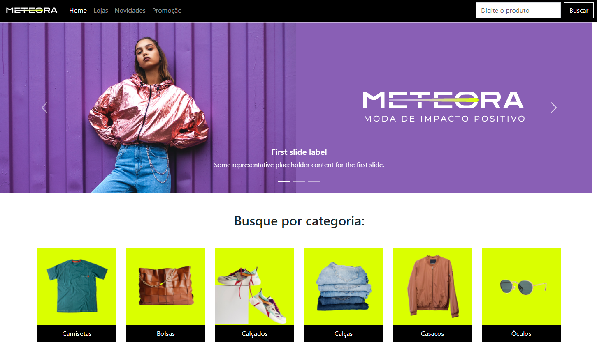

# Meteora - Página de Venda de Produtos de Moda

Este é um projeto de página única estática para venda de produtos de moda, desenvolvido com o framework Bootstrap 5 e o curso ([Alura](https://cursos.alura.com.br/course/bootstrap5-landing-page-responsiva)) "Bootstrap5: crie uma landing page responsiva
". A página inclui diversos componentes como navbar, carousel, cards, forms e footer, proporcionando uma experiência de navegação moderna e responsiva.

## Visão Geral

A página "Meteora" foi projetada para exibir produtos de moda de forma elegante e acessível. Com uma navegação intuitiva e design atrativo, os usuários podem explorar facilmente os produtos oferecidos e realizar compras de maneira rápida e eficiente.

## Funcionalidades

- **Navbar:** Barra de navegação fixa no topo da página, facilitando o acesso às diferentes seções.
- **Carousel:** Slideshow de imagens para destacar produtos ou promoções.
- **Cards:** Exibição de produtos em cartões organizados, com informações e imagens.
- **Forms:** Formulários para cadastro e contato com a loja.
- **Footer:** Rodapé com informações adicionais e links úteis.

## Tecnologias Utilizadas

- **HTML5**
- **CSS3**
- **Bootstrap 5**

## Teste

O projeto pode ser visualizado e testado em:

- [Vercel](https://meteora-bootstrap5-lemon.vercel.app/)

## Screenshots

